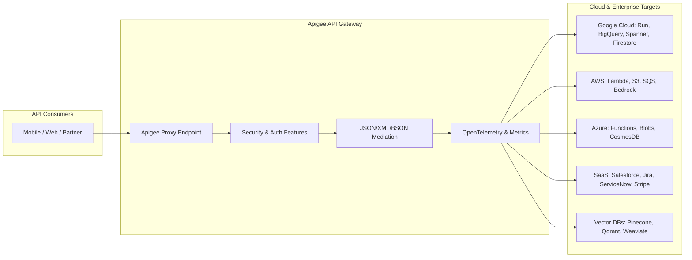

# Apigee Templates Repository

[](https://opensource.org/licenses/Apache-2.0)
[](https://cloud.google.com/apigee)
[](#)

Welcome to the **Apigee Templates Repository** — an enterprise catalog of modular, reusable, and battle-tested Apigee Feature Templater (`aft`) definitions, policy configurations, and cloud integration patterns.

---

## Table of Contents

- [Overview & Architecture](#overview--architecture)
- [Quick Start](#quick-start)
- [Released Features](#released-features)
- [Draft Extension Features (100+)](#draft-extension-features-100)
  - [1. Google Cloud Services](#1-google-cloud-services)
  - [2. Databases & Data Stores](#2-databases--data-stores)
  - [3. AWS Cloud Services](#3-aws-cloud-services)
  - [4. Azure Cloud Services](#4-azure-cloud-services)
  - [5. SaaS & CRM Integrations](#5-saas--crm-integrations)
  - [6. Vector Databases, Search & AI](#6-vector-databases-search--ai)
  - [7. Security, Identity & Governance](#7-security-identity--governance)
  - [8. Transformation & Protocol Mediation](#8-transformation--protocol-mediation)
  - [9. Traffic Management & Observability](#9-traffic-management--observability)
- [How to Deploy with `aft`](#how-to-deploy-with-aft)
- [Repository Structure](#repository-structure)
- [Contributing](#contributing)

---

## Overview & Architecture

The Apigee Templater engine allows developers to compose enterprise API Proxies by assembling declarative **Feature YAML** definitions into unified **Templates**. Each feature encapsulates endpoints, fault rules, policies (OAuth, KVM, Service Callouts, AssignMessage, JavaScript ES5), and target connections.



---

## Released Features

Production-ready features available for immediate deployment.

| Feature | Name | Description | Category | Colab Notebook |
|---|---|---|---|---|
| **`ai-anthropic`** | Anthropic Claude API Proxy | Proxy for Anthropic Claude models with KVM credential management and header manipulation. | `AI` | [](https://colab.research.google.com/github/GoogleCloudPlatform/apigee-templates-repository/blob/main/notebooks/ai-anthropic.ipynb) |
| **`ai-completions`** | OpenAI Chat Completions API Proxy | Multi-provider Chat Completions API proxy supporting OpenAI, Google Cloud Vertex AI, and Anthropic targets with OpenAPI validation. | `AI` | [](https://colab.research.google.com/github/GoogleCloudPlatform/apigee-templates-repository/blob/main/notebooks/ai-completions.ipynb) |
| **`ai-key-quota`** | AI Key Verification & Quota Enforcement | Developer app group verification, token-level LLM quota enforcement, analytics data capture, and unauthorized fault handling. | `AI` | [](https://colab.research.google.com/github/GoogleCloudPlatform/apigee-templates-repository/blob/main/notebooks/ai-key-quota.ipynb) |
| **`ai-post-analytics`** | AI Base Post Functions & Analytics | Base AI & LLM response handling with token counting, cost calculation, streaming EventFlow capture, and DataCapture collectors. | `AI` | [](https://colab.research.google.com/github/GoogleCloudPlatform/apigee-templates-repository/blob/main/notebooks/ai-post-analytics.ipynb) |
| **`ai-pre-validate`** | AI Pre-Validation & Model Routing | Request inspection, cross-format protocol conversion (OpenAI/Anthropic/Gemini), and intelligent model-to-target routing. | `AI` | [](https://colab.research.google.com/github/GoogleCloudPlatform/apigee-templates-repository/blob/main/notebooks/ai-pre-validate.ipynb) |
| **`oas-validation`** | OpenAPI Request Validation | In-flight OpenAPI 3.0/3.1/3.2+ request validation for paths, query parameters, headers, and JSON body payloads. | `VALIDATION` | [](https://colab.research.google.com/github/GoogleCloudPlatform/apigee-templates-repository/blob/main/notebooks/oas-validation.ipynb) |
| **`piimask-presidio`** | PII Masking with Microsoft Presidio | Sensitive data redaction and anonymization using Microsoft Presidio analyzer and anonymizer service callouts. | `SECURITY` | [](https://colab.research.google.com/github/GoogleCloudPlatform/apigee-templates-repository/blob/main/notebooks/piimask-presidio.ipynb) |
| **`piimask-sdp`** | PII Masking with Cloud Sensitive Data Protection | In-flight request and response PII inspection and de-identification using Google Cloud Sensitive Data Protection (DLP). | `SECURITY` | [](https://colab.research.google.com/github/GoogleCloudPlatform/apigee-templates-repository/blob/main/notebooks/piimask-sdp.ipynb) |

---

## Draft Extension Features (100+)

> [!NOTE]
> All features below carry the `category: draft` tag to indicate that they are in active testing and integration validation. Each feature includes a dedicated Jupyter notebook in [`notebooks/`](notebooks/) that you can open and run directly in Google Colab.

### 1. Google Cloud Services

| Feature ID | Display Name | Description | Colab Notebook |
|---|---|---|---|
| **`cloud-run-proxy`** | Google Cloud Run Service Proxy | Proxies incoming requests to a private or public Google Cloud Run microservice with automated Google OIDC ID token minting and path routing. | [](https://colab.research.google.com/github/GoogleCloudPlatform/apigee-templates-repository/blob/main/notebooks/cloud-run-proxy.ipynb) |
| **`bigquery-query-proxy`** | BigQuery SQL Query & Result Transformer | Executes parameterized SQL queries against Google BigQuery REST API with schema flattening, row mapping, and JSON response normalization. | [](https://colab.research.google.com/github/GoogleCloudPlatform/apigee-templates-repository/blob/main/notebooks/bigquery-query-proxy.ipynb) |
| **`bigquery-dataset-proxy`** | BigQuery Dataset & Table Management | Provides secure API proxying for BigQuery dataset and table metadata operations with access control and JSON structure normalization. | [](https://colab.research.google.com/github/GoogleCloudPlatform/apigee-templates-repository/blob/main/notebooks/bigquery-dataset-proxy.ipynb) |
| **`cloudsql-rest-proxy`** | Google Cloud SQL REST API Proxy | Proxies requests to Google Cloud SQL Admin & Query APIs with IAM authentication, query payload validation, and connection error handling. | [](https://colab.research.google.com/github/GoogleCloudPlatform/apigee-templates-repository/blob/main/notebooks/cloudsql-rest-proxy.ipynb) |
| **`spanner-query-proxy`** | Google Cloud Spanner SQL REST Proxy | Executes SQL statements on Google Cloud Spanner instances via REST API with result set row-to-object JSON mapping and transaction handling. | [](https://colab.research.google.com/github/GoogleCloudPlatform/apigee-templates-repository/blob/main/notebooks/spanner-query-proxy.ipynb) |
| **`alloydb-rest-proxy`** | Google Cloud AlloyDB Admin & Query Proxy | Secure proxy for Google Cloud AlloyDB for PostgreSQL clusters with connection pooling metadata, IAM token exchange, and query proxying. | [](https://colab.research.google.com/github/GoogleCloudPlatform/apigee-templates-repository/blob/main/notebooks/alloydb-rest-proxy.ipynb) |
| **`firestore-rest-proxy`** | Cloud Firestore Document & Collection Proxy | Proxies Cloud Firestore REST API with bidirectional translation between Firestore typed JSON (stringValue, integerValue, mapValue) and clean standard JSON. | [](https://colab.research.google.com/github/GoogleCloudPlatform/apigee-templates-repository/blob/main/notebooks/firestore-rest-proxy.ipynb) |
| **`cloud-storage-json-proxy`** | Cloud Storage (GCS) JSON Gateway | Proxies Google Cloud Storage JSON API for bucket/object listing, metadata inspection, and authenticated pre-signed URL delegation. | [](https://colab.research.google.com/github/GoogleCloudPlatform/apigee-templates-repository/blob/main/notebooks/cloud-storage-json-proxy.ipynb) |
| **`cloud-pubsub-publisher`** | Cloud Pub/Sub Message Publisher | Ingests incoming JSON events, encodes payloads to base64, attaches dynamic message attributes, and publishes them to Google Cloud Pub/Sub topics. | [](https://colab.research.google.com/github/GoogleCloudPlatform/apigee-templates-repository/blob/main/notebooks/cloud-pubsub-publisher.ipynb) |
| **`cloud-tasks-queue`** | Cloud Tasks Task Dispatcher | Schedules and dispatches background tasks via Google Cloud Tasks with payload serialization, schedule time delay, and queue routing. | [](https://colab.research.google.com/github/GoogleCloudPlatform/apigee-templates-repository/blob/main/notebooks/cloud-tasks-queue.ipynb) |
| **`cloud-translation-proxy`** | Cloud Translation Multi-Language Proxy | Proxies Google Cloud Translation v3 API with source language auto-detection, response caching, and simplified string array output. | [](https://colab.research.google.com/github/GoogleCloudPlatform/apigee-templates-repository/blob/main/notebooks/cloud-translation-proxy.ipynb) |
| **`cloud-vision-proxy`** | Cloud Vision AI OCR & Label Proxy | Accepts base64 images or Cloud Storage URIs and queries Google Cloud Vision API for OCR text extraction, label annotations, and safe search detection. | [](https://colab.research.google.com/github/GoogleCloudPlatform/apigee-templates-repository/blob/main/notebooks/cloud-vision-proxy.ipynb) |
| **`cloud-speech-proxy`** | Cloud Speech-to-Text Recognition Proxy | Proxies Google Cloud Speech-to-Text v2 API for synchronous and batch audio transcriptions with audio configuration validation. | [](https://colab.research.google.com/github/GoogleCloudPlatform/apigee-templates-repository/blob/main/notebooks/cloud-speech-proxy.ipynb) |
| **`cloud-secret-manager`** | Cloud Secret Manager Access & Cache | Retrieves secret payloads from Google Cloud Secret Manager with payload decoding and environment-level KVM response caching. | [](https://colab.research.google.com/github/GoogleCloudPlatform/apigee-templates-repository/blob/main/notebooks/cloud-secret-manager.ipynb) |
| **`cloud-logging-sink`** | Cloud Logging Custom Telemetry Sink | Asynchronously streams structured API audit logs and execution metrics into Google Cloud Logging (Stackdriver) with severity classification. | [](https://colab.research.google.com/github/GoogleCloudPlatform/apigee-templates-repository/blob/main/notebooks/cloud-logging-sink.ipynb) |

### 2. Databases & Data Stores

| Feature ID | Display Name | Description | Colab Notebook |
|---|---|---|---|
| **`mongodb-atlas-data-api`** | MongoDB Atlas Data API Proxy | Proxies MongoDB Atlas Data API with API Key authentication, BSON-to-JSON type translation (ObjectId, ISODate), and query filter validation. | [](https://colab.research.google.com/github/GoogleCloudPlatform/apigee-templates-repository/blob/main/notebooks/mongodb-atlas-data-api.ipynb) |
| **`snowflake-sql-api`** | Snowflake SQL REST API Proxy | Executes SQL statements through the Snowflake SQL REST API with JWT key-pair authentication, query status polling, and row-column mapping. | [](https://colab.research.google.com/github/GoogleCloudPlatform/apigee-templates-repository/blob/main/notebooks/snowflake-sql-api.ipynb) |
| **`redis-rest-upstash`** | Redis REST API Gateway (Upstash / GCP Memorystore) | Proxies Redis key-value commands (GET, SET, HGETALL, LPUSH, PIPELINE) via HTTP REST interface with token authentication and response formatting. | [](https://colab.research.google.com/github/GoogleCloudPlatform/apigee-templates-repository/blob/main/notebooks/redis-rest-upstash.ipynb) |
| **`couchdb-proxy`** | Apache CouchDB / Cloudant Document Proxy | Proxies Apache CouchDB / IBM Cloudant REST endpoints with Basic Auth injection, revision ID tracking, and Mango query translation. | [](https://colab.research.google.com/github/GoogleCloudPlatform/apigee-templates-repository/blob/main/notebooks/couchdb-proxy.ipynb) |
| **`neo4j-rest-proxy`** | Neo4j Cypher Transaction API Proxy | Executes Cypher graph queries over the Neo4j HTTP Transaction API with graph node/relationship JSON serialization. | [](https://colab.research.google.com/github/GoogleCloudPlatform/apigee-templates-repository/blob/main/notebooks/neo4j-rest-proxy.ipynb) |
| **`cassandra-stargate-proxy`** | Apache Cassandra Stargate Document Proxy | Proxies Apache Cassandra / DataStax Astra Stargate Document API with token lifecycle handling and CQL-to-JSON object mapping. | [](https://colab.research.google.com/github/GoogleCloudPlatform/apigee-templates-repository/blob/main/notebooks/cassandra-stargate-proxy.ipynb) |
| **`dynamodb-rest-proxy`** | AWS DynamoDB REST Query & Item Proxy | Translates high-level JSON requests to AWS DynamoDB low-level attribute format ({S: 'val', N: '123'}) and unmarshals query responses. | [](https://colab.research.google.com/github/GoogleCloudPlatform/apigee-templates-repository/blob/main/notebooks/dynamodb-rest-proxy.ipynb) |
| **`cosmosdb-rest-proxy`** | Azure Cosmos DB SQL API Proxy | Proxies Azure Cosmos DB SQL API with master key authorization token calculation, partition key header routing, and document querying. | [](https://colab.research.google.com/github/GoogleCloudPlatform/apigee-templates-repository/blob/main/notebooks/cosmosdb-rest-proxy.ipynb) |
| **`clickhouse-http-proxy`** | ClickHouse Columnar HTTP Proxy | Proxies analytical queries to ClickHouse HTTP interface with FORMAT JSON extraction, compression support, and query timeout enforcement. | [](https://colab.research.google.com/github/GoogleCloudPlatform/apigee-templates-repository/blob/main/notebooks/clickhouse-http-proxy.ipynb) |
| **`faunadb-graphql-proxy`** | FaunaDB Document Database Proxy | Proxies FaunaDB HTTP GraphQL & FQL endpoints with Secret Key injection and cursor-based pagination normalization. | [](https://colab.research.google.com/github/GoogleCloudPlatform/apigee-templates-repository/blob/main/notebooks/faunadb-graphql-proxy.ipynb) |
| **`planetscale-database-proxy`** | PlanetScale MySQL Serverless Proxy | Proxies PlanetScale Serverless MySQL API with Service Token authentication, transactional session headers, and structured error reporting. | [](https://colab.research.google.com/github/GoogleCloudPlatform/apigee-templates-repository/blob/main/notebooks/planetscale-database-proxy.ipynb) |
| **`supabase-postgrest-proxy`** | Supabase PostgREST API Proxy | Proxies Supabase / PostgREST RESTful database endpoints with JWT verification, RLS (Row Level Security) role forwarding, and filter translation. | [](https://colab.research.google.com/github/GoogleCloudPlatform/apigee-templates-repository/blob/main/notebooks/supabase-postgrest-proxy.ipynb) |

### 3. AWS Cloud Services

| Feature ID | Display Name | Description | Colab Notebook |
|---|---|---|---|
| **`aws-lambda-proxy`** | AWS Lambda Serverless Function Proxy | Invokes AWS Lambda functions directly via AWS REST API using AWS Signature Version 4 (SigV4) authentication with synchronous and asynchronous invocation modes. | [](https://colab.research.google.com/github/GoogleCloudPlatform/apigee-templates-repository/blob/main/notebooks/aws-lambda-proxy.ipynb) |
| **`aws-s3-proxy`** | AWS S3 Object Gateway Proxy | Proxies Amazon S3 REST API for object retrieval, upload mediation, and bucket listing with AWS SigV4 authorization. | [](https://colab.research.google.com/github/GoogleCloudPlatform/apigee-templates-repository/blob/main/notebooks/aws-s3-proxy.ipynb) |
| **`aws-sqs-proxy`** | AWS SQS Queue Message Producer | Sends JSON messages to AWS Simple Queue Service (SQS) queues with automatic SigV4 signing, message deduplication IDs, and delay configuration. | [](https://colab.research.google.com/github/GoogleCloudPlatform/apigee-templates-repository/blob/main/notebooks/aws-sqs-proxy.ipynb) |
| **`aws-sns-proxy`** | AWS SNS Topic Notification Publisher | Publishes structured push notifications and broadcast alerts to Amazon Simple Notification Service (SNS) topics with message attributes. | [](https://colab.research.google.com/github/GoogleCloudPlatform/apigee-templates-repository/blob/main/notebooks/aws-sns-proxy.ipynb) |
| **`aws-eventbridge-proxy`** | AWS EventBridge Event Ingestion Proxy | Ingests custom enterprise application events into AWS EventBridge event buses with schema validation and SigV4 authentication. | [](https://colab.research.google.com/github/GoogleCloudPlatform/apigee-templates-repository/blob/main/notebooks/aws-eventbridge-proxy.ipynb) |
| **`aws-stepfunctions-proxy`** | AWS Step Functions Execution Trigger | Starts workflow executions on AWS Step Functions state machines with input validation, idempotency token generation, and execution status tracking. | [](https://colab.research.google.com/github/GoogleCloudPlatform/apigee-templates-repository/blob/main/notebooks/aws-stepfunctions-proxy.ipynb) |
| **`aws-kinesis-proxy`** | AWS Kinesis Data Stream Record Ingestion | Ingests real-time high-throughput streaming records into Amazon Kinesis Data Streams with partition key hashing and SigV4 signing. | [](https://colab.research.google.com/github/GoogleCloudPlatform/apigee-templates-repository/blob/main/notebooks/aws-kinesis-proxy.ipynb) |
| **`aws-bedrock-proxy`** | AWS Bedrock Foundation Models Proxy | Proxies AWS Bedrock Converse and InvokeModel endpoints for Claude, Titan, and Llama models with SigV4 authentication and token usage capture. | [](https://colab.research.google.com/github/GoogleCloudPlatform/apigee-templates-repository/blob/main/notebooks/aws-bedrock-proxy.ipynb) |
| **`aws-secretsmanager-proxy`** | AWS Secrets Manager Lookup & Cache | Fetches secrets from AWS Secrets Manager using SigV4 authorization with local in-memory/KVM caching to reduce AWS API call frequency. | [](https://colab.research.google.com/github/GoogleCloudPlatform/apigee-templates-repository/blob/main/notebooks/aws-secretsmanager-proxy.ipynb) |
| **`aws-ses-email-proxy`** | AWS SES Transactional Email Dispatcher | Sends transactional emails via AWS Simple Email Service (SES) v2 REST API with HTML sanitization, sender verification, and SigV4 signing. | [](https://colab.research.google.com/github/GoogleCloudPlatform/apigee-templates-repository/blob/main/notebooks/aws-ses-email-proxy.ipynb) |

### 4. Azure Cloud Services

| Feature ID | Display Name | Description | Colab Notebook |
|---|---|---|---|
| **`azure-functions-proxy`** | Azure Functions HTTP Trigger Proxy | Proxies incoming API calls to serverless Azure Functions with automated Function Key injection (x-functions-key) or Entra ID OAuth token injection. | [](https://colab.research.google.com/github/GoogleCloudPlatform/apigee-templates-repository/blob/main/notebooks/azure-functions-proxy.ipynb) |
| **`azure-blob-storage-proxy`** | Azure Blob Storage REST Gateway | Proxies Azure Blob Storage REST API with Shared Access Signature (SAS) token generation and container object operations. | [](https://colab.research.google.com/github/GoogleCloudPlatform/apigee-templates-repository/blob/main/notebooks/azure-blob-storage-proxy.ipynb) |
| **`azure-service-bus-proxy`** | Azure Service Bus Message Dispatcher | Sends messages to Azure Service Bus Queues and Topics using SAS token authentication (SharedAccessSignature) with message properties. | [](https://colab.research.google.com/github/GoogleCloudPlatform/apigee-templates-repository/blob/main/notebooks/azure-service-bus-proxy.ipynb) |
| **`azure-event-grid-proxy`** | Azure Event Grid CloudEvents Publisher | Publishes CloudEvents 1.0 compliant JSON events to Azure Event Grid topics with SAS key or token authentication. | [](https://colab.research.google.com/github/GoogleCloudPlatform/apigee-templates-repository/blob/main/notebooks/azure-event-grid-proxy.ipynb) |
| **`azure-key-vault-proxy`** | Azure Key Vault Secret Retrieval & Cache | Retrieves secrets and certificates from Azure Key Vault REST API using Entra ID OAuth tokens with Apigee response caching. | [](https://colab.research.google.com/github/GoogleCloudPlatform/apigee-templates-repository/blob/main/notebooks/azure-key-vault-proxy.ipynb) |
| **`azure-openai-proxy`** | Azure OpenAI Deployment Gateway | Proxies Azure OpenAI model deployments (GPT-4o, GPT-3.5-Turbo) with api-key header injection, rate limit monitoring, and usage tracking. | [](https://colab.research.google.com/github/GoogleCloudPlatform/apigee-templates-repository/blob/main/notebooks/azure-openai-proxy.ipynb) |
| **`azure-cognitive-search`** | Azure AI Search Query & Indexing Proxy | Proxies Azure AI Search (formerly Cognitive Search) index querying and document updates with api-key authentication and result formatting. | [](https://colab.research.google.com/github/GoogleCloudPlatform/apigee-templates-repository/blob/main/notebooks/azure-cognitive-search.ipynb) |
| **`azure-logic-apps-proxy`** | Azure Logic Apps Workflow Trigger | Triggers automated workflows in Azure Logic Apps via HTTP POST trigger endpoints with signature verification and payload normalization. | [](https://colab.research.google.com/github/GoogleCloudPlatform/apigee-templates-repository/blob/main/notebooks/azure-logic-apps-proxy.ipynb) |
| **`azure-sql-rest-proxy`** | Azure SQL Database REST Management Proxy | Proxies Azure SQL Database management and elastic pool REST APIs with Entra ID bearer token authentication and resource filtering. | [](https://colab.research.google.com/github/GoogleCloudPlatform/apigee-templates-repository/blob/main/notebooks/azure-sql-rest-proxy.ipynb) |
| **`azure-event-hubs-proxy`** | Azure Event Hubs Telemetry Stream Proxy | Streams event telemetry batches into Azure Event Hubs with partition key distribution, SAS token signing, and JSON batching. | [](https://colab.research.google.com/github/GoogleCloudPlatform/apigee-templates-repository/blob/main/notebooks/azure-event-hubs-proxy.ipynb) |

### 5. SaaS & CRM Integrations

| Feature ID | Display Name | Description | Colab Notebook |
|---|---|---|---|
| **`salesforce-rest-proxy`** | Salesforce REST API & SOQL Query Proxy | Proxies Salesforce REST API and SOQL queries with automatic OAuth2 access token refresh, instance URL routing, and record transformation. | [](https://colab.research.google.com/github/GoogleCloudPlatform/apigee-templates-repository/blob/main/notebooks/salesforce-rest-proxy.ipynb) |
| **`jira-rest-proxy`** | Atlassian Jira Cloud REST API Proxy | Proxies Atlassian Jira Cloud REST API v3 for issue creation, JQL search, and sprint updates with Basic Auth / API token injection. | [](https://colab.research.google.com/github/GoogleCloudPlatform/apigee-templates-repository/blob/main/notebooks/jira-rest-proxy.ipynb) |
| **`servicenow-table-proxy`** | ServiceNow Table API Incident & CMDB Proxy | Proxies ServiceNow Table API for incident tracking, change requests, and CMDB records with OAuth/Basic Auth and sysparm validation. | [](https://colab.research.google.com/github/GoogleCloudPlatform/apigee-templates-repository/blob/main/notebooks/servicenow-table-proxy.ipynb) |
| **`hubspot-crm-proxy`** | HubSpot CRM Contacts & Deals API Proxy | Proxies HubSpot CRM v3 REST API with private app token authentication, rate limit backoff handling, and property mapping. | [](https://colab.research.google.com/github/GoogleCloudPlatform/apigee-templates-repository/blob/main/notebooks/hubspot-crm-proxy.ipynb) |
| **`zendesk-support-proxy`** | Zendesk Support Tickets API Proxy | Proxies Zendesk Support REST API v2 for ticket creation, comments, and user management with API token authentication. | [](https://colab.research.google.com/github/GoogleCloudPlatform/apigee-templates-repository/blob/main/notebooks/zendesk-support-proxy.ipynb) |
| **`workday-raas-proxy`** | Workday Report-as-a-Service (RaaS) Proxy | Proxies Workday RaaS endpoints with ISU (Integration System User) credentials, XML-to-JSON reporting conversion, and pagination. | [](https://colab.research.google.com/github/GoogleCloudPlatform/apigee-templates-repository/blob/main/notebooks/workday-raas-proxy.ipynb) |
| **`sap-odata-proxy`** | SAP S/4HANA OData to REST Proxy | Mediates between modern REST JSON clients and SAP S/4HANA OData v2/v4 services with CSRF token fetching and OData response unwrapping. | [](https://colab.research.google.com/github/GoogleCloudPlatform/apigee-templates-repository/blob/main/notebooks/sap-odata-proxy.ipynb) |
| **`slack-webhook-proxy`** | Slack Incoming Webhook & Bot Proxy | Transforms simple alerts into Slack Block Kit interactive message payloads and dispatches them via Slack Webhooks or Web API. | [](https://colab.research.google.com/github/GoogleCloudPlatform/apigee-templates-repository/blob/main/notebooks/slack-webhook-proxy.ipynb) |
| **`msteams-webhook-proxy`** | Microsoft Teams Adaptive Cards Proxy | Accepts incident alerts and formats them into Microsoft Teams Adaptive Cards 1.4 JSON payloads sent to Office 365 Incoming Webhooks. | [](https://colab.research.google.com/github/GoogleCloudPlatform/apigee-templates-repository/blob/main/notebooks/msteams-webhook-proxy.ipynb) |
| **`stripe-payments-proxy`** | Stripe Payments & Customers API Proxy | Proxies Stripe REST API for PaymentIntents, Customers, and Charges with Secret Key injection, Idempotency-Key propagation, and error mapping. | [](https://colab.research.google.com/github/GoogleCloudPlatform/apigee-templates-repository/blob/main/notebooks/stripe-payments-proxy.ipynb) |
| **`twilio-sms-proxy`** | Twilio SMS & Messaging API Proxy | Dispatches SMS messages via Twilio Messaging API with E.164 phone number validation, Basic Auth credentials, and URL-encoded body transformation. | [](https://colab.research.google.com/github/GoogleCloudPlatform/apigee-templates-repository/blob/main/notebooks/twilio-sms-proxy.ipynb) |
| **`sendgrid-mail-proxy`** | SendGrid v3 Mail Send API Proxy | Proxies SendGrid v3 Mail Send API with Bearer token injection, recipient list deduplication, and template ID mapping. | [](https://colab.research.google.com/github/GoogleCloudPlatform/apigee-templates-repository/blob/main/notebooks/sendgrid-mail-proxy.ipynb) |
| **`github-api-proxy`** | GitHub REST API v3 Gateway | Proxies GitHub REST API with Personal Access Token (PAT) / GitHub App installation token injection, User-Agent header compliance, and rate limit tracking. | [](https://colab.research.google.com/github/GoogleCloudPlatform/apigee-templates-repository/blob/main/notebooks/github-api-proxy.ipynb) |
| **`gitlab-api-proxy`** | GitLab REST API v4 Proxy | Proxies GitLab Projects, Pipelines, and Issues REST API with PRIVATE-TOKEN header injection and project ID URL-encoding. | [](https://colab.research.google.com/github/GoogleCloudPlatform/apigee-templates-repository/blob/main/notebooks/gitlab-api-proxy.ipynb) |
| **`pagerduty-events-proxy`** | PagerDuty Events API v2 Proxy | Ingests incident triggers, acknowledgments, and resolutions into PagerDuty Events API v2 with routing key injection and payload validation. | [](https://colab.research.google.com/github/GoogleCloudPlatform/apigee-templates-repository/blob/main/notebooks/pagerduty-events-proxy.ipynb) |
| **`okta-management-proxy`** | Okta Core & Users Management API Proxy | Proxies Okta Management API for user provisioning, group management, and factor enrollment with SSWS API token authentication. | [](https://colab.research.google.com/github/GoogleCloudPlatform/apigee-templates-repository/blob/main/notebooks/okta-management-proxy.ipynb) |

### 6. Vector Databases, Search & AI

| Feature ID | Display Name | Description | Colab Notebook |
|---|---|---|---|
| **`pinecone-vector-proxy`** | Pinecone Vector Database Proxy | Proxies Pinecone Vector DB REST API for vector upserts, semantic similarity queries, and namespace filtering with Api-Key header injection. | [](https://colab.research.google.com/github/GoogleCloudPlatform/apigee-templates-repository/blob/main/notebooks/pinecone-vector-proxy.ipynb) |
| **`qdrant-vector-proxy`** | Qdrant Vector Database Proxy | Proxies Qdrant Vector Search engine REST API for nearest-neighbor point search, payload filtering, and batch embedding insertion with api-key authentication. | [](https://colab.research.google.com/github/GoogleCloudPlatform/apigee-templates-repository/blob/main/notebooks/qdrant-vector-proxy.ipynb) |
| **`weaviate-vector-proxy`** | Weaviate Vector Search & GraphQL Proxy | Proxies Weaviate Vector Database GraphQL & REST v1 objects API with Bearer token authentication and NearText / NearVector query formatting. | [](https://colab.research.google.com/github/GoogleCloudPlatform/apigee-templates-repository/blob/main/notebooks/weaviate-vector-proxy.ipynb) |
| **`milvus-vector-proxy`** | Milvus / Zilliz Cloud Vector Proxy | Proxies Milvus v2 / Zilliz Cloud vector search REST API with Bearer token authentication, output field selection, and vector search parameters. | [](https://colab.research.google.com/github/GoogleCloudPlatform/apigee-templates-repository/blob/main/notebooks/milvus-vector-proxy.ipynb) |
| **`chroma-vector-proxy`** | Chroma Vector Database REST Proxy | Proxies Chroma Open-Source / Hosted Vector DB REST API v1 for collection querying, embedding storage, and metadata filtering. | [](https://colab.research.google.com/github/GoogleCloudPlatform/apigee-templates-repository/blob/main/notebooks/chroma-vector-proxy.ipynb) |
| **`vertex-ai-search-proxy`** | Vertex AI Search & Conversation Proxy | Proxies Google Cloud Vertex AI Search & Conversation (Agent Builder) data store query API with Google OAuth token injection and citation parsing. | [](https://colab.research.google.com/github/GoogleCloudPlatform/apigee-templates-repository/blob/main/notebooks/vertex-ai-search-proxy.ipynb) |
| **`elasticsearch-rest-proxy`** | Elasticsearch & OpenSearch REST Proxy | Proxies Elasticsearch and OpenSearch `_search` queries with Basic/API key auth, DSL query validation, and hit extraction. | [](https://colab.research.google.com/github/GoogleCloudPlatform/apigee-templates-repository/blob/main/notebooks/elasticsearch-rest-proxy.ipynb) |
| **`cohere-generate-proxy`** | Cohere Chat & Embeddings API Proxy | Proxies Cohere v1 /chat and /embed endpoints with Bearer token authentication, input validation, and token billing capture. | [](https://colab.research.google.com/github/GoogleCloudPlatform/apigee-templates-repository/blob/main/notebooks/cohere-generate-proxy.ipynb) |
| **`mistral-ai-proxy`** | Mistral AI Chat & Embeddings Proxy | Proxies Mistral AI models (mistral-large, mistral-small, mistral-embed) with Bearer token authentication and token analytics capture. | [](https://colab.research.google.com/github/GoogleCloudPlatform/apigee-templates-repository/blob/main/notebooks/mistral-ai-proxy.ipynb) |
| **`groq-inference-proxy`** | Groq Ultra-Fast LPU Inference Proxy | Proxies GroqCloud ultra-fast OpenAI-compatible LLM inference API with Bearer token authentication and latency monitoring. | [](https://colab.research.google.com/github/GoogleCloudPlatform/apigee-templates-repository/blob/main/notebooks/groq-inference-proxy.ipynb) |
| **`replicate-predictions-proxy`** | Replicate ML Predictions Dispatcher | Dispatches machine learning model predictions to Replicate REST API with Bearer token authentication, webhook URL attachment, and status polling. | [](https://colab.research.google.com/github/GoogleCloudPlatform/apigee-templates-repository/blob/main/notebooks/replicate-predictions-proxy.ipynb) |
| **`ollama-local-proxy`** | Ollama Self-Hosted LLM Gateway | Proxies on-premise or VPC self-hosted Ollama model instances (/api/generate, /api/chat) with request authentication and payload normalization. | [](https://colab.research.google.com/github/GoogleCloudPlatform/apigee-templates-repository/blob/main/notebooks/ollama-local-proxy.ipynb) |

### 7. Security, Identity & Governance

| Feature ID | Display Name | Description | Colab Notebook |
|---|---|---|---|
| **`oauth2-token-exchange`** | OAuth 2.0 RFC 8693 Token Exchange | Implements RFC 8693 OAuth 2.0 Token Exchange to securely swap external IDP tokens (Okta, Azure AD, Cognito) for internal Apigee / GCP access tokens. | [](https://colab.research.google.com/github/GoogleCloudPlatform/apigee-templates-repository/blob/main/notebooks/oauth2-token-exchange.ipynb) |
| **`jwt-claims-transformer`** | JWT Claims Extraction & Context Enrichment | Parses and verifies incoming JSON Web Tokens (JWT), extracts nested custom claims, and injects them as HTTP headers for backend microservices. | [](https://colab.research.google.com/github/GoogleCloudPlatform/apigee-templates-repository/blob/main/notebooks/jwt-claims-transformer.ipynb) |
| **`hmac-auth-validator`** | HMAC-SHA256 Request Signature Validator | Validates incoming HTTP request HMAC-SHA256 signatures against request headers, timestamp, nonce, and payload hash with clock-skew defense. | [](https://colab.research.google.com/github/GoogleCloudPlatform/apigee-templates-repository/blob/main/notebooks/hmac-auth-validator.ipynb) |
| **`api-key-dynamic-lookup`** | Dynamic Multi-Tenant API Key Lookup | Performs dynamic multi-tenant API key resolution against encrypted KVM or external IDP with tier-based rate limit assignment. | [](https://colab.research.google.com/github/GoogleCloudPlatform/apigee-templates-repository/blob/main/notebooks/api-key-dynamic-lookup.ipynb) |
| **`mtls-client-cert-auth`** | Mutual TLS Client Certificate Validator | Inspects mTLS client certificate attributes (Subject DN, SAN, Issuer, Serial Number, Fingerprint) and enforces organizational identity policies. | [](https://colab.research.google.com/github/GoogleCloudPlatform/apigee-templates-repository/blob/main/notebooks/mtls-client-cert-auth.ipynb) |
| **`ip-whitelist-geofencing`** | CIDR IP Whitelist & Geofencing Filter | Enforces strict CIDR subnet IP whitelisting and country-level geofencing rules using True-Client-IP and X-Forwarded-For headers. | [](https://colab.research.google.com/github/GoogleCloudPlatform/apigee-templates-repository/blob/main/notebooks/ip-whitelist-geofencing.ipynb) |
| **`content-safety-sanitizer`** | Request Content Safety & Injection Sanitizer | Inspects incoming JSON payloads in-flight for SQL injection, Cross-Site Scripting (XSS), command injection, and malicious unicode patterns. | [](https://colab.research.google.com/github/GoogleCloudPlatform/apigee-templates-repository/blob/main/notebooks/content-safety-sanitizer.ipynb) |
| **`webhook-stripe-verifier`** | Stripe Webhook Signature Verifier | Verifies incoming Stripe webhook `Stripe-Signature` headers (t=timestamp, v1=signature) using HMAC-SHA256 and rejects expired replay attacks. | [](https://colab.research.google.com/github/GoogleCloudPlatform/apigee-templates-repository/blob/main/notebooks/webhook-stripe-verifier.ipynb) |
| **`webhook-github-verifier`** | GitHub Webhook HMAC-SHA256 Verifier | Verifies `X-Hub-Signature-256` headers on incoming GitHub Webhooks against a shared secret before routing to internal build workers. | [](https://colab.research.google.com/github/GoogleCloudPlatform/apigee-templates-repository/blob/main/notebooks/webhook-github-verifier.ipynb) |
| **`webhook-shopify-verifier`** | Shopify Webhook HMAC-SHA256 Verifier | Validates `X-Shopify-Hmac-Sha256` signatures on Shopify store webhooks (orders/create, customers/update) with payload integrity checking. | [](https://colab.research.google.com/github/GoogleCloudPlatform/apigee-templates-repository/blob/main/notebooks/webhook-shopify-verifier.ipynb) |
| **`cors-policy-customizer`** | Dynamic CORS Policy Customizer | Handles CORS preflight OPTIONS requests dynamically with multi-origin regex allowlists, custom allowed headers, and credentials forwarding. | [](https://colab.research.google.com/github/GoogleCloudPlatform/apigee-templates-repository/blob/main/notebooks/cors-policy-customizer.ipynb) |
| **`pii-regex-redactor`** | In-Flight PII Regex Redactor | High-performance in-flight JavaScript regex sanitizer redacting Social Security Numbers (SSN), Credit Cards, and emails from request/response bodies. | [](https://colab.research.google.com/github/GoogleCloudPlatform/apigee-templates-repository/blob/main/notebooks/pii-regex-redactor.ipynb) |

### 8. Transformation & Protocol Mediation

| Feature ID | Display Name | Description | Colab Notebook |
|---|---|---|---|
| **`soap-to-rest-translator`** | SOAP XML to REST JSON Translator | Transforms clean incoming REST JSON requests into legacy SOAP 1.1/1.2 XML Envelopes with XML namespaces, and parses SOAP responses back to JSON. | [](https://colab.research.google.com/github/GoogleCloudPlatform/apigee-templates-repository/blob/main/notebooks/soap-to-rest-translator.ipynb) |
| **`json-to-xml-translator`** | JSON to XML Bidirectional Formatter | Converts incoming JSON payloads to XML format using Apigee JSONtoXML policies and transforms backend XML responses back into clean JSON. | [](https://colab.research.google.com/github/GoogleCloudPlatform/apigee-templates-repository/blob/main/notebooks/json-to-xml-translator.ipynb) |
| **`graphql-rest-wrapper`** | REST-to-GraphQL Query Aggregator | Wraps complex backend GraphQL endpoints into clean, predictable RESTful resource endpoints (/users/{id}/orders) for mobile and web clients. | [](https://colab.research.google.com/github/GoogleCloudPlatform/apigee-templates-repository/blob/main/notebooks/graphql-rest-wrapper.ipynb) |
| **`grpc-web-rest-transcoder`** | REST to gRPC-Web Gateway Transcoder | Accepts standard REST JSON requests, converts payloads into Protobuf binary or gRPC-Web JSON format, and calls gRPC-Web proxy backends. | [](https://colab.research.google.com/github/GoogleCloudPlatform/apigee-templates-repository/blob/main/notebooks/grpc-web-rest-transcoder.ipynb) |
| **`csv-to-json-transformer`** | CSV Stream to JSON Array Converter | Parses incoming multipart or raw CSV data streams and translates records into structured JSON object arrays with header detection. | [](https://colab.research.google.com/github/GoogleCloudPlatform/apigee-templates-repository/blob/main/notebooks/csv-to-json-transformer.ipynb) |
| **`xml-json-path-extractor`** | XPath & JSONPath Dynamic Property Extractor | Extracts targeted fields from large complex XML or JSON request/response bodies using XPath/JSONPath and sets flow variables for routing. | [](https://colab.research.google.com/github/GoogleCloudPlatform/apigee-templates-repository/blob/main/notebooks/xml-json-path-extractor.ipynb) |
| **`gzip-brotli-mediator`** | HTTP Gzip & Brotli Content Compression Mediator | Handles Accept-Encoding negotiation, decompressing payloads on ingest when required and compressing upstream responses for bandwidth savings. | [](https://colab.research.google.com/github/GoogleCloudPlatform/apigee-templates-repository/blob/main/notebooks/gzip-brotli-mediator.ipynb) |
| **`multipart-form-parser`** | Multipart Form-Data to JSON Converter | Parses multipart/form-data boundary payloads, extracts text fields and binary file metadata, and converts the request into structured JSON. | [](https://colab.research.google.com/github/GoogleCloudPlatform/apigee-templates-repository/blob/main/notebooks/multipart-form-parser.ipynb) |
| **`response-field-masker`** | Dynamic Response Field Masker & Projector | Implements client-driven sparse fieldsets (`?fields=id,name,email,address.city`) to filter and mask large JSON response objects at the gateway. | [](https://colab.research.google.com/github/GoogleCloudPlatform/apigee-templates-repository/blob/main/notebooks/response-field-masker.ipynb) |
| **`api-version-mediator`** | API Versioning & Deprecation Notice Injector | Normalizes API versioning across Header (`Accept-Version: v2`), Query (`?v=2`), and Path (`/v2/`), injecting Sunset & Deprecation RFC 8594 headers. | [](https://colab.research.google.com/github/GoogleCloudPlatform/apigee-templates-repository/blob/main/notebooks/api-version-mediator.ipynb) |

### 9. Traffic Management & Observability

| Feature ID | Display Name | Description | Colab Notebook |
|---|---|---|---|
| **`rate-limit-dynamic-kvm`** | Dynamic Tiered Rate Limiter with KVM Quota | Enforces dynamic per-minute and per-day rate limits resolved dynamically from KVM based on consumer plan (Bronze, Silver, Gold, Platinum). | [](https://colab.research.google.com/github/GoogleCloudPlatform/apigee-templates-repository/blob/main/notebooks/rate-limit-dynamic-kvm.ipynb) |
| **`spike-arrest-burst-smoother`** | Spike Arrest & Concurrency Burst Smoother | Protects backend microservices from sudden traffic spikes and DDoS surges using Apigee SpikeArrest and ConcurrentRateLimit policies. | [](https://colab.research.google.com/github/GoogleCloudPlatform/apigee-templates-repository/blob/main/notebooks/spike-arrest-burst-smoother.ipynb) |
| **`circuit-breaker-failover`** | Circuit Breaker & Automatic Target Failover | Monitors target HTTP 5xx error rates and timeouts, tripping a circuit breaker to divert traffic to a cached fallback or secondary datacenter. | [](https://colab.research.google.com/github/GoogleCloudPlatform/apigee-templates-repository/blob/main/notebooks/circuit-breaker-failover.ipynb) |
| **`response-cache-invalidation`** | Response Cache with Dynamic Invalidation | Caches GET query responses using Apigee ResponseCache policy, with support for instant cache invalidation on PUT/POST/DELETE mutations. | [](https://colab.research.google.com/github/GoogleCloudPlatform/apigee-templates-repository/blob/main/notebooks/response-cache-invalidation.ipynb) |
| **`multi-region-load-balancer`** | Multi-Region Target Load Balancer & Health Check | Distributes incoming traffic across multiple GCP regions (us-central1, europe-west1, asia-east1) with weighted round-robin and health failover. | [](https://colab.research.google.com/github/GoogleCloudPlatform/apigee-templates-repository/blob/main/notebooks/multi-region-load-balancer.ipynb) |
| **`opentelemetry-trace-exporter`** | OpenTelemetry W3C TraceContext Exporter | Propagates W3C TraceContext (`traceparent`, `tracestate`) headers and exports distributed span telemetry to an OpenTelemetry collector. | [](https://colab.research.google.com/github/GoogleCloudPlatform/apigee-templates-repository/blob/main/notebooks/opentelemetry-trace-exporter.ipynb) |
| **`datadog-metrics-forwarder`** | Datadog Custom Metrics & Event Forwarder | Extracts latency, status codes, and error categories from each transaction and pushes metric series to Datadog v2 Metrics API via Service Callout. | [](https://colab.research.google.com/github/GoogleCloudPlatform/apigee-templates-repository/blob/main/notebooks/datadog-metrics-forwarder.ipynb) |
| **`splunk-hec-forwarder`** | Splunk HTTP Event Collector (HEC) Audit Forwarder | Captures sanitized request/response metadata and security audit logs, streaming JSON events into Splunk HEC with Splunk token auth. | [](https://colab.research.google.com/github/GoogleCloudPlatform/apigee-templates-repository/blob/main/notebooks/splunk-hec-forwarder.ipynb) |
| **`dynatrace-rum-injector`** | Dynatrace RUM & Server Timing Injector | Injects Dynatrace OneAgent correlation headers (`x-dynatrace-test`) and Server-Timing performance breakdown metrics in responses. | [](https://colab.research.google.com/github/GoogleCloudPlatform/apigee-templates-repository/blob/main/notebooks/dynatrace-rum-injector.ipynb) |
| **`synthetic-health-monitor`** | Synthetic Deep Health Check & Readiness Endpoint | Provides an automated `/healthz` & `/readyz` endpoint that executes parallel health probes against downstream targets, KVMs, and caches. | [](https://colab.research.google.com/github/GoogleCloudPlatform/apigee-templates-repository/blob/main/notebooks/synthetic-health-monitor.ipynb) |
| **`mock-faker-service`** | Dynamic Edge Mock Engine with Faker Generation | Generates realistic, dynamic mock JSON responses (users, transactions, products, addresses) at the Apigee edge without calling backend targets. | [](https://colab.research.google.com/github/GoogleCloudPlatform/apigee-templates-repository/blob/main/notebooks/mock-faker-service.ipynb) |
| **`request-replay-recorder`** | Request Capture & Dead Letter Queue (DLQ) Recorder | Captures failed client requests (HTTP 5xx, timeouts) and forwards the original method, headers, and body to a Google Cloud Pub/Sub DLQ for replay. | [](https://colab.research.google.com/github/GoogleCloudPlatform/apigee-templates-repository/blob/main/notebooks/request-replay-recorder.ipynb) |

---

## How to Deploy with `aft`

### 1. Installation
```bash
npm install -g @google-cloud/apigee-templater
```

### 2. Deploying a Template or Feature
```bash
# Deploy a template bundle combining multiple features
aft templates/REST-AI-Completions.yaml -o $GOOGLE_CLOUD_PROJECT:REST-AI-Completions

# Or deploy an individual feature proxy directly
aft deploy features/cloud-run-proxy.yaml --org $GOOGLE_CLOUD_PROJECT --env eval
```

---

## Repository Structure
```
├── features/        # Modular Apigee Feature YAML definitions
├── templates/       # Multi-feature composite API proxy templates
├── notebooks/       # Google Colab runnable test & deployment notebooks
├── src/             # ES5 JavaScript utilities & schema validators
└── tests/           # Unit and integration test suites
```

---

## Contributing
1. Fork the repository.
2. Add new feature YAMLs to `features/` with `category: draft`.
3. Create a corresponding Jupyter Notebook in `notebooks/`.
4. Run `npm test` to ensure all tests pass.
5. Submit a Pull Request.
